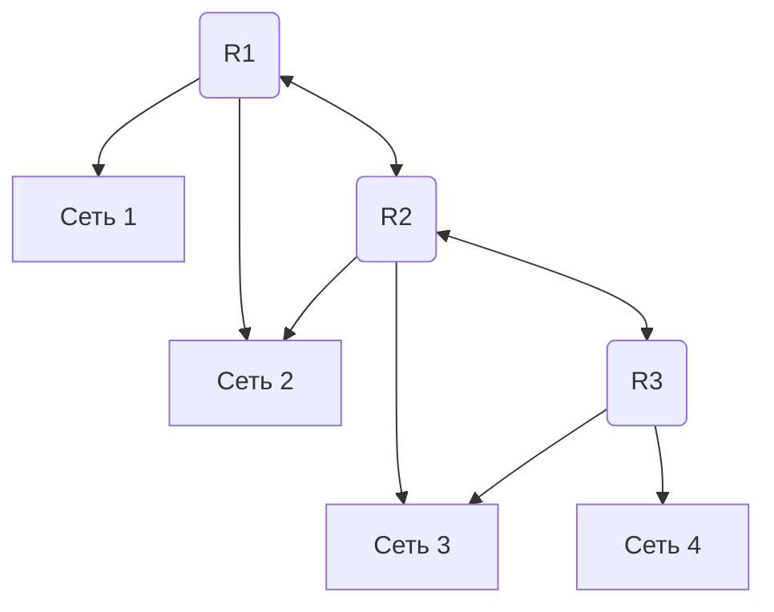

#### 1. Назначение, задачи и функции, выполняемые на (указан один из семи уровней) уровне модели OSI

Модель **OSI (Open Systems Interconnection)** - Это эталонная семиуровневая модель взаимодействия открытых систем, разработанная ISO для стандартизации телекоммуникационных протоколов.

**Ключевые принципы модели:**
1. **Инкапсуляция** - каждый уровень работает только со своим заголовком
2. **Независимость уровней** - изменение одного уровня не требует изменения других
3. **Стандартизация интерфейсов** - чёткие точки взаимодействия между уровнями
4. **Модульность** - возможность замены протоколов внутри уровня

##### Уровни модели OSI

| Уровень | Название (EN/RU)             | Единица данных         |
| ------- | ---------------------------- | ---------------------- |
| 7       | Application / Прикладной     | Данные (Data)          |
| 6       | Presentation / Представления | Данные (Data)          |
| 5       | Session / Сеансовый          | Данные (Data)          |
| 4       | Transport / Транспортный     | Сегменты / Дейтаграммы |
| 3       | Network / Сетевой            | Пакеты                 |
| 2       | Data Link / Канальный        | Кадры (Frames)         |
| 1       | Physical / Физический        | Биты                   |

###### Уровень 1: Физический (Physical)
**Назначение:** Передача необработанных битов через физическую среду

**Задачи и функции:**
- Определение электрических, механических, процедурных и функциональных характеристик интерфейса
- Кодирование и модуляция сигнала
- Синхронизация битов
- Определение типа среды передачи (витая пара, оптоволокно, радиоканал)
- Передача битового потока без проверки ошибок

**Примеры:** RS-232, Ethernet (физический уровень), USB, Wi-Fi (PHY), оптические интерфейсы

###### Уровень 2: Канальный (Data Link)
**Назначение:** Обеспечение надёжной передачи данных между непосредственно соединёнными узлами

**Задачи и функции:**
- Физическая адресация (MAC-адреса)
- Формирование кадров (фрагментация/сборка)
- Обнаружение и коррекция ошибок (CRC)
- Управление доступом к среде (MAC-подуровень: CSMA/CD, токеновое кольцо)
- Управление потоком между соседними узлами
- Полудуплексный/дуплексный режим

**Примеры:** Ethernet (IEEE 802.3), Wi-Fi (IEEE 802.11), PPP, HDLC, VLAN (802.1Q)

###### Уровень 3: Сетевой (Network)
**Назначение:** Маршрутизация пакетов между различными сетями

**Задачи и функции:**
- Логическая адресация (IP-адреса)
- Определение оптимального пути (маршрутизация)
- Фрагментация и сборка пакетов
- Управление перегрузками
- Межсетевое взаимодействие
- Поддержка виртуальных каналов и дейтаграмм

**Примеры:** IP (IPv4/IPv6), ICMP, IPSec, OSPF, BGP, RIP, MPLS

###### Уровень 4: Транспортный (Transport)
**Назначение:** Обеспечение сквозной (end-to-end) передачи данных между хостами

**Задачи и функции:**
- Сегментация и сборка данных
- Адресация портов (мультиплексирование приложений)
- Гарантированная доставка (подтверждения, повторная передача)
- Управление потоком (оконные механизмы)
- Контроль перегрузок
- Упорядочивание сегментов
- Выбор между соединением (TCP) и без соединения (UDP)

**Примеры:** TCP, UDP, SCTP, DCCP

###### Уровень 5: Сеансовый (Session)
**Назначение:** Управление диалогом между приложениями

**Задачи и функции:**
- Установка, поддержание и завершение сеансов связи
- Синхронизация диалога (контрольные точки)
- Управление правами доступа (кто передаёт в данный момент)
- Восстановление сеанса после сбоя
- Разделение потоков данных

**Примеры:** RPC, NetBIOS, PPTP, SIP (частично), TLS handshake (частично)

###### Уровень 6: Представления (Presentation)
**Назначение:** Преобразование данных в формат, понятный приложению.

**Задачи и функции:**
- Кодирование/декодирование данных (ASCII, Unicode, EBCDIC)
- Шифрование и дешифрование
- Сжатие данных
- Преобразование форматов (например, JPEG, MPEG, XML, JSON)
- Согласование синтаксиса между системами

**Примеры:** SSL/TLS (шифрование), MIME, XDR, JPEG, MPEG, ASCII/Unicode

###### Уровень 7: Прикладной (Application)
**Назначение:** Предоставление сетевых сервисов непосредственно пользовательским приложениям

**Задачи и функции:**
- Интерфейс между приложением и сетевыми службами
- Идентификация партнёров связи
- Определение ресурсов и синхронизация
- Поддержка сетевых сервисов: почта, файлы, удалённый доступ

**Примеры:** HTTP/HTTPS, FTP, SMTP, DNS, SSH, Telnet, SNMP, DHCP

#### 2. Протокол TCP. Принципы работы, формат заголовка.

**TCP** - Это надёжный, ориентированный на соединение протокол транспортного уровня, обеспечивающий доставку данных в правильном порядке и без потерь

##### Ключевые принципы
| Принцип                           | Описание                                                                                                               |
| --------------------------------- | ---------------------------------------------------------------------------------------------------------------------- |
| **Установка соединения**          | Используется трёхэтапное рукопожатие (SYN → SYN-ACK → ACK) для инициализации соединения                                |
| **Нумерация последовательностей** | Каждому октету данных присваивается 32-битный номер последовательности для упорядочивания и обнаружения потерь         |
| **Подтверждения (ACK)**           | Получатель отправляет подтверждения о полученных данных; при отсутствии ACK в течение таймаута данные переотправляются |
| **Контроль потока**               | Механизм окна (Window) позволяет получателю управлять скоростью отправки данных                                        |
| **Контроль перегрузок**           | Алгоритмы (slow start, congestion avoidance) адаптируют скорость передачи к состоянию сети                             |
| **Контроль целостности**          | 16-битная контрольная сумма (checksum) вычисляется для заголовка и данных, включая псевдозаголовок IP                  |
| **Мультиплексирование**           | Использует порты (16 бит) для различения нескольких соединений на одном хосте                                          |

##### Формат заголовка TCP

```
   0                   1                   2                   3
    0 1 2 3 4 5 6 7 8 9 0 1 2 3 4 5 6 7 8 9 0 1 2 3 4 5 6 7 8 9 0 1
   +-+-+-+-+-+-+-+-+-+-+-+-+-+-+-+-+-+-+-+-+-+-+-+-+-+-+-+-+-+-+-+-+
   |          Source Port          |       Destination Port        |
   +-+-+-+-+-+-+-+-+-+-+-+-+-+-+-+-+-+-+-+-+-+-+-+-+-+-+-+-+-+-+-+-+
   |                        Sequence Number                        |
   +-+-+-+-+-+-+-+-+-+-+-+-+-+-+-+-+-+-+-+-+-+-+-+-+-+-+-+-+-+-+-+-+
   |                    Acknowledgment Number                      |
   +-+-+-+-+-+-+-+-+-+-+-+-+-+-+-+-+-+-+-+-+-+-+-+-+-+-+-+-+-+-+-+-+
   |  Data |       |C|E|U|A|P|R|S|F|                               |
   | Offset| Rsrvd |W|C|R|C|S|S|Y|I|            Window             |
   |       |       |R|E|G|K|H|T|N|N|                               |
   +-+-+-+-+-+-+-+-+-+-+-+-+-+-+-+-+-+-+-+-+-+-+-+-+-+-+-+-+-+-+-+-+
   |           Checksum            |         Urgent Pointer        |
   +-+-+-+-+-+-+-+-+-+-+-+-+-+-+-+-+-+-+-+-+-+-+-+-+-+-+-+-+-+-+-+-+
   |                           [Options]                           |
   +-+-+-+-+-+-+-+-+-+-+-+-+-+-+-+-+-+-+-+-+-+-+-+-+-+-+-+-+-+-+-+-+
   |                                                               :
   :                             Data                              :
   :                                                               |
   +-+-+-+-+-+-+-+-+-+-+-+-+-+-+-+-+-+-+-+-+-+-+-+-+-+-+-+-+-+-+-+-+
```

| Поле                      | Размер    | Описание                                                                                                                     |
| ------------------------- | --------- | ---------------------------------------------------------------------------------------------------------------------------- |
| **Source Port**           | 16 бит    | Порт отправителя                                                                                                             |
| **Destination Port**      | 16 бит    | Порт получателя                                                                                                              |
| **Sequence Number**       | 32 бита   | Номер первого октета данных в сегменте (или ISN при установке соединения)                                                    |
| **Acknowledgment Number** | 32 бита   | Ожидаемый номер следующего октета (действителен при установленном флаге ACK)                                                 |
| **Data Offset**           | 4 бита    | Длина заголовка в 32-битных словах (указывает начало данных)                                                                 |
| **Reserved**              | 6 бит     | Зарезервировано, должно быть 0                                                                                               |
| **Control Flags**         | 6 бит     | `URG` (срочные данные), `ACK` (подтверждение), `PSH` (протолкнуть), `RST` (сброс), `SYN` (синхронизация), `FIN` (завершение) |
| **Window**                | 16 бит    | Размер окна приёма (количество октетов, которые получатель готов принять)                                                    |
| **Checksum**              | 16 бит    | Контрольная сумма заголовка, данных и псевдозаголовка IP                                                                     |
| **Urgent Pointer**        | 16 бит    | Смещение до конца срочных данных (действителен при установленном флаге URG)                                                  |
| **Options**               | переменно | Дополнительные параметры (MSS, Window Scale, Timestamps и др.)                                                               |
| **Data**                  | переменно | Пользовательские данные передающиеся с помощью TCP                                                                           |

###### Псевдозаголовок для расчёта checksum
```
                +--------+--------+--------+--------+
                |           Source Address          |
                +--------+--------+--------+--------+
                |         Destination Address       |
                +--------+--------+--------+--------+
                |  zero  |  PTCL  |    TCP Length   |
                +--------+--------+--------+--------+
```

#### 3. Протокол UDP. Принципы работы, формат заголовка.

**UDP** - Это простой, неориентированный на соединение протокол транспортного уровня, обеспечивающий минимальную задержку без гарантий доставки

##### Ключевые принципы:
| Принцип                        | Описание                                                                                 |
| ------------------------------ | ---------------------------------------------------------------------------------------- |
| **Отсутствие соединения**      | Не требует установки соединения перед передачей данных (connectionless)                  |
| **Отсутствие подтверждений**   | Нет механизма ACK, повторных передач или упорядочивания                                  |
| **Минимальный оверхед**        | Заголовок всего 8 байт, что снижает задержки и нагрузку на ЦП                            |
| **Негарантированная доставка** | Потеря, дублирование или изменение порядка пакетов возможны и не исправляются протоколом |
| **Контрольная сумма**          | Опциональная проверка целостности (включая псевдозаголовок IP)                           |
| **Мультиплексирование**        | Использует порты (16 бит) для различения приложений                                      |

##### Формат заголовка UDP
```
                  0      7 8     15 16    23 24    31
                 +--------+--------+--------+--------+
                 |     Source      |   Destination   |
                 |      Port       |      Port       |
                 +--------+--------+--------+--------+
                 |                 |                 |
                 |     Length      |    Checksum     |
                 +--------+--------+--------+--------+
                 |
                 |          data octets ...
                 +---------------- ...
```

| Поле                 | Размер | Описание                                                                                          |
| -------------------- | ------ | ------------------------------------------------------------------------------------------------- |
| **Source Port**      | 16 бит | Порт отправителя (опционально; 0, если не используется)                                           |
| **Destination Port** | 16 бит | Порт получателя (обязателен для доставки)                                                         |
| **Length**           | 16 бит | Длина датаграммы в октетах, включая заголовок и данные (минимум 8)                                |
| **Checksum**         | 16 бит | Контрольная сумма заголовка, данных и псевдозаголовка IP (опционально в IPv4, обязательно в IPv6) |

###### Псевдозаголовок для расчёта checksum:
```
+--------+--------+--------+--------+
|          source address           |
+--------+--------+--------+--------+
|        destination address        |
+--------+--------+--------+--------+
|  zero  |protocol|   UDP length    |
+--------+--------+--------+--------+
```

#### 4. Протокол IP. Принципы работы, формат заголовка.

**IP (Internet Protocol)** - Это сетевой протокол уровня 3 (сетевой уровень) модели OSI/TCP-IP, обеспечивающий маршрутизацию и доставку пакетов данных в сетях

##### Ключевые характеристики:

|Характеристика|Описание|
|---|---|
|**Без установления соединения**|Не требует предварительного соединения перед передачей данных (connectionless)|
|**Ненадёжная доставка**|Не гарантирует доставку, порядок или целостность пакетов - это задача вышележащих протоколов (TCP)|
|**Маршрутизация**|Использует таблицы маршрутизации для определения пути к получателю|
|**Адресация**|Использует логические IP-адреса (IPv4: 32 бита, IPv6: 128 бит)|
|**Фрагментация**|Может делить пакеты на фрагменты при прохождении через сети с меньшим MTU|
##### Принцип передачи данных:
1. Приложение формирует данные
2. Транспортный уровень (TCP/UDP) добавляет свой заголовок
3. Сетевой уровень (IP) добавляет IP-заголовок → образуется датаграмма
4. Канальный уровень инкапсулирует в кадр
5. Маршрутизаторы анализируют IP-заголовок и пересылают пакет дальше
6. Получатель извлекает данные, удаляя заголовки в обратном порядке

#### 5. Формат кадра пакета IPv4

```
	0                   1                   2                   3
    0 1 2 3 4 5 6 7 8 9 0 1 2 3 4 5 6 7 8 9 0 1 2 3 4 5 6 7 8 9 0 1
   +-+-+-+-+-+-+-+-+-+-+-+-+-+-+-+-+-+-+-+-+-+-+-+-+-+-+-+-+-+-+-+-+
   |Version|  IHL  |Type of Service|          Total Length         |
   +-+-+-+-+-+-+-+-+-+-+-+-+-+-+-+-+-+-+-+-+-+-+-+-+-+-+-+-+-+-+-+-+
   |         Identification        |Flags|      Fragment Offset    |
   +-+-+-+-+-+-+-+-+-+-+-+-+-+-+-+-+-+-+-+-+-+-+-+-+-+-+-+-+-+-+-+-+
   |  Time to Live |    Protocol   |         Header Checksum       |
   +-+-+-+-+-+-+-+-+-+-+-+-+-+-+-+-+-+-+-+-+-+-+-+-+-+-+-+-+-+-+-+-+
   |                       Source Address                          |
   +-+-+-+-+-+-+-+-+-+-+-+-+-+-+-+-+-+-+-+-+-+-+-+-+-+-+-+-+-+-+-+-+
   |                    Destination Address                        |
   +-+-+-+-+-+-+-+-+-+-+-+-+-+-+-+-+-+-+-+-+-+-+-+-+-+-+-+-+-+-+-+-+
   |                    Options                    |    Padding    |
   +-+-+-+-+-+-+-+-+-+-+-+-+-+-+-+-+-+-+-+-+-+-+-+-+-+-+-+-+-+-+-+-+
```

| Поле                             | Размер (бит) | Назначение                                                 |
| -------------------------------- | ------------ | ---------------------------------------------------------- |
| **Version**                      | 4            | Версия протокола (всегда 4 для IPv4)                       |
| **IHL** (Internet Header Length) | 4            | Длина заголовка в 32-битных словах (мин. 5 = 20 байт)      |
| **Type of Service**              | 8            | Приоритет и качество обслуживания (DSCP/ECN)               |
| **Total Length**                 | 16           | Общая длина пакета (заголовок + данные), макс. 65 535 байт |
| **Identification**               | 16           | Идентификатор для фрагментации                             |
| **Flags**                        | 3            | Флаги фрагментации (DF, MF)                                |
| **Fragment Offset**              | 13           | Смещение фрагмента в единицах 8 байт                       |
| **Time to Live (TTL)**           | 8            | Максимальное число переходов (хопов)                       |
| **Protocol**                     | 8            | Протокол верхнего уровня (6=TCP, 17=UDP, 1=ICMP)           |
| **Header Checksum**              | 16           | Контрольная сумма только заголовка                         |
| **Source Address**               | 32           | IPv4-адрес отправителя                                     |
| **Destination Address**          | 32           | IPv4-адрес получателя                                      |
| **Options + Padding**            | переменное   | Дополнительные опции (выравнивание до 32 бит)              |

#### 6. Формат кадра пакета IPv6

```
   +-+-+-+-+-+-+-+-+-+-+-+-+-+-+-+-+-+-+-+-+-+-+-+-+-+-+-+-+-+-+-+-+
   |Version| Traffic Class |           Flow Label                  |
   +-+-+-+-+-+-+-+-+-+-+-+-+-+-+-+-+-+-+-+-+-+-+-+-+-+-+-+-+-+-+-+-+
   |         Payload Length        |  Next Header  |   Hop Limit   |
   +-+-+-+-+-+-+-+-+-+-+-+-+-+-+-+-+-+-+-+-+-+-+-+-+-+-+-+-+-+-+-+-+
   |                                                               |
   +                                                               +
   |                                                               |
   +                         Source Address                        +
   |                                                               |
   +                                                               +
   |                                                               |
   +-+-+-+-+-+-+-+-+-+-+-+-+-+-+-+-+-+-+-+-+-+-+-+-+-+-+-+-+-+-+-+-+
   |                                                               |
   +                                                               +
   |                                                               |
   +                      Destination Address                      +
   |                                                               |
   +                                                               +
   |                                                               |
   +-+-+-+-+-+-+-+-+-+-+-+-+-+-+-+-+-+-+-+-+-+-+-+-+-+-+-+-+-+-+-+-+
```

| Поле                    | Размер (бит) | Назначение                                                                                        |
| ----------------------- | ------------ | ------------------------------------------------------------------------------------------------- |
| **Version**             | 4            | Версия протокола (всегда 6 для IPv6)                                                              |
| **Traffic Class**       | 8            | Аналог ToS в IPv4: приоритет и ECN                                                                |
| **Flow Label**          | 20           | Маркировка потока для QoS и обработки в маршрутизаторах                                           |
| **Payload Length**      | 16           | Длина полезной нагрузки (после заголовка) в байтах                                                |
| **Next Header**         | 8            | Тип следующего заголовка (аналог Protocol в IPv4): TCP=6, UDP=17, ICMPv6=58, или номер расширения |
| **Hop Limit**           | 8            | Аналог TTL: максимальное число переходов                                                          |
| **Source Address**      | 128          | IPv6-адрес отправителя                                                                            |
| **Destination Address** | 128          | IPv6-адрес получателя                                                                             |

###### Расширенные заголовки 
```
[Основной заголовок 40 байт] → [Hop-by-Hop] → [Routing] → [Fragment] → [AH/ESP] → [Destination Options] → [Данные верхнего уровня]
```

| Расширенный заголовок | Next Header | Назначение                                              |
| --------------------- | ----------- | ------------------------------------------------------- |
| Hop-by-Hop Options    | 0           | Обрабатывается каждым узлом на пути                     |
| Routing               | 43          | Указание маршрута (source routing)                      |
| Fragment              | 44          | Фрагментация (вместо фрагментации в основном заголовке) |
| ESP                   | 50          | Инкапсуляция безопасности (шифрование)                  |
| AH                    | 51          | Аутентификация заголовка                                |
| Destination Options   | 60          | Обрабатывается только получателем                       |

#### 7. Маршрутизация в IP сетях

##### Основные понятия

**Маршрутизация** - Это процесс выбора пути передачи IP-пакетов от источника к получателю через одну или несколько сетей.

**Основная задача маршрутизации** - доставить пакет по оптимальному маршруту

Устройства, выполняющие маршрутизацию, называются **маршрутизаторами** (routers)

**Маршрут по умолчанию** - Используется при отсутствии точного маршрута(Обычно направляет трафик к маршрутизатору провайдера):
- `0.0.0.0/0`

##### Основные функции маршрутизатора
- Определение наилучшего маршрута к сети назначения
- Передача пакетов между сетями
- Хранение таблицы маршрутизации
- Обмен маршрутной информацией с другими маршрутизаторами

##### Структура таблицы маршрутизации
```
| Адрес сети назначения | Маска сети | Шлюз (next hop) | Интерфейс выхода | Метрика маршрута |
```

##### Виды маршрутизации

| Вид              | Описание                                                                                           | Преимущества                                                                          | Недостатки                                               |
| ---------------- | -------------------------------------------------------------------------------------------------- | ------------------------------------------------------------------------------------- | -------------------------------------------------------- |
| **Статическая**  | Маршруты задаются администратором вручную                                                          | Предсказуемость, минимальные ресурсы                                                  | Не масштабируется, не адаптируется к отказам             |
| **Динамическая** | Маршрутизаторы автоматически обмениваются информацией о маршрутах с помощью специальных протоколов | Автоматическое обновление маршрутов, хорошая масштабируемость, устойчивость к отказам | Дополнительная нагрузка на сеть, более сложная настройка |

###### Протоколы динамической маршрутизации

| Протокол | Тип                    | Метрика                          | Особенности                                                       | Область применения     |
| -------- | ---------------------- | -------------------------------- | ----------------------------------------------------------------- | ---------------------- |
| **RIP**  | Дистанционно-векторный | Количество переходов (hop count) | Простота, медленная сходимость, максимум 15 hops                  | Небольшие сети         |
| **OSPF** | Link State             | Стоимость канала                 | Быстрая сходимость, алгоритм Дейкстры, высокая производительность | Средние и крупные сети |
| **BGP**  | Внешняя маршрутизация  | Политики и атрибуты пути         | Управление маршрутами между автономными системами                 | Интернет и провайдеры  |
##### Основные метрики маршрутизации

| Метрика         | Описание                           |
| --------------- | ---------------------------------- |
| **Hop Count**   | Количество маршрутизаторов до сети |
| **Bandwidth**   | Пропускная способность канала      |
| **Delay**       | Задержка передачи                  |
| **Reliability** | Надёжность канала                  |
| **Load**        | Загруженность канала               |
| **Cost**        | Стоимость маршрута                 |

##### Процесс маршрутизации IP-пакета
1. Узел формирует IP-пакет.
2. Проверяется IP-адрес назначения.
3. Маршрутизатор ищет подходящий маршрут в таблице.
4. Пакет передается следующему узлу.
5. Процесс повторяется до достижения адресата.


#### 8. Протокол Ethernet. Принципы работы. Формат кадра. MAC адресация
**Ethernet** - Это технология канального уровня (L2 модели OSI), определяющая способ доступа к среде передачи данных и формат кадров

##### Основные принципы:
1. **CSMA/CD (Carrier Sense Multiple Access with Collision Detection)** - метод множественного доступа с контролем несущей и обнаружением коллизий:
    - **Carrier Sense**: перед передачей узел «слушает» среду - если она свободна, начинает передачу
    - **Multiple Access**: несколько узлов могут пытаться передавать одновременно
    - **Collision Detection**: если коллизия обнаружена, передача прекращается, отправляется сигнал «jam», затем узлы ждут случайное время перед повторной попыткой
2. **Полудуплексный и полнодуплексный режимы**:
    - В полудуплексе используется CSMA/CD (актуально для старых коаксиальных сетей)
    - В полнодуплексе (современные коммутаторы) коллизии невозможны, CSMA/CD отключён
3. **Физическая топология**: звезда (через коммутатор) или шина (устаревшая)
4. **Адресация на канальном уровне**: используется 48-битный MAC-адрес для доставки кадров внутри локальной сети

##### Формат кадра Ethernet (IEEE 802.3)

```
+-+-+-+-+-+-+-+-+-+-+-+-+-+-+-+-+-+-+-+-+-+-+-+-+-+-+-+-+-+-+-+-+-+-+-+
| Preamble | SFD | Destination MAC | Source MAC | Length | Data | FCS |
+-+-+-+-+-+-+-+-+-+-+-+-+-+-+-+-+-+-+-+-+-+-+-+-+-+-+-+-+-+-+-+-+-+-+-+
```

| Поле                            | Размер (байты) | Описание                                                                 |
| ------------------------------- | -------------- | ------------------------------------------------------------------------ |
| **Preamble**                    | 7              | Паттерн `10101010...` для синхронизации тактовой частоты                 |
| **SFD (Start Frame Delimiter)** | 1              | `10101011` - маркер начала кадра                                         |
| **Destination MAC**             | 6              | MAC-адрес получателя                                                     |
| **Source MAC**                  | 6              | MAC-адрес отправителя                                                    |
| **Length / Type**               | 2              | В 802.3: длина данных (0–1500); в Ethernet II: тип протокола (EtherType) |
| **Payload (Data)**              | 46–1500        | Полезная нагрузка (при необходимости дополняется паддингом до 46 байт)   |
| **FCS (Frame Check Sequence)**  | 4              | CRC-32 для контроля целостности кадра                                    |
- **Минимальный размер кадра**: 64 байта (без преамбулы и SFD)  
- **Максимальный размер**: 1518 байт (без VLAN-тега) или 1522 байта с 802.1Q

##### Варианты кадров:
- **IEEE 802.3**: поле длины + LLC/SNAP-заголовок
- **Ethernet II (DIX)**: поле EtherType (наиболее распространён в современных сетях)

##### MAC-адресация
**MAC-адрес** - Это уникальный 48-битный физический адрес сетевого устройства

###### Структура MAC-адреса

```
[I/G][U/L][OUI][NIC]
  |    |    |    |
  ├----┘    |    └─ NIC(Network Interface Controller Specific 24 бита) - Номер интерфейса
  |         |
  |         └─ OUI (Organizationally Unique Identifier, 22 бита) - Идентификатор производителя
  |
  └ Биты управления:
   • I/G (Individual/Group): 0 = unicast, 1 = multicast/broadcast
   • U/L (Universal/Local): 0 = глобально уникальный, 1 = локально администрируемый
```

###### Типы MAC-адресов:

| Тип           | Значение бита I/G | Пример              | Назначение                   |
| ------------- | ----------------- | ------------------- | ---------------------------- |
| **Unicast**   | 0                 | `00:1A:2B:3C:4D:5E` | Доставка одному узлу         |
| **Multicast** | 1                 | `01:00:5E:xx:xx:xx` | Доставка группе узлов        |
| **Broadcast** | все 1             | `FF:FF:FF:FF:FF:FF` | Доставка всем узлам сегмента |

#### 9. Методы доступа к среде передачи.
**Метод доступа** - Это способ определения того, какая рабочая станция сети сможет следующей использовать канал связи. 


##### Категории методов

###### Случайные (вероятностные)

| Метод                                                                | Описание                                                                                                                                                                                                                                                                    |
| -------------------------------------------------------------------- | --------------------------------------------------------------------------------------------------------------------------------------------------------------------------------------------------------------------------------------------------------------------------- |
| **CSMA/CD** (Carrier Sense Multiple Access with Collision Detection) | Станция проверяет канал перед передачей. Если канал свободен - начинает передачу, продолжая прослушивать сеть для обнаружения коллизий. При конфликте обе станции прекращают передачу и ждут случайное время перед повторной попыткой (механизм «экспоненциального отката») |
| **CSMA/CA** (Collision Avoidance)                                    | Используется в беспроводных сетях: станция не только слушает канал, но и отправляет короткие служебные кадры (RTS/CTS) для резервирования среды и предотвращения коллизий                                                                                                   |

###### Детерминированные

| Метод                                           | Описание                                                                                                                          |
| ----------------------------------------------- | --------------------------------------------------------------------------------------------------------------------------------- |
| **TPMA / Token Passing**                        | Передача специального кадра - маркера - даёт станции право на передачу данных. Конфликты невозможны, гарантируется время доставки |
| **TDMA** (Time Division Multiple Access)        | Время делится на фиксированные интервалы, каждый узел передаёт только в своём слоте.                                              |
| **FDMA / WDMA** (Frequency/Wavelength Division) | Среда делится по частотам или длинам волн, каждый канал выделяется отдельному узлу.                                               |

##### Сравнение методов
| Критерий        | Случайные методы                                        | Детерминированные методы                                |
| --------------- | ------------------------------------------------------- | ------------------------------------------------------- |
| **Достоинства** | Простота реализации, не требуют центрального управления | Высокая эффективность канала, поддержка приоритетов     |
| **Недостатки**  | Возможны коллизии и задержки                            | Требуют алгоритма управления маркером или синхронизации |

#### 10. Беспроводные устройства локальных сетей

##### Основные устройства для построения беспроводных локальных сетей (WLAN) на базе стандарта IEEE 802.11
| Устройство                                    | Назначение                                                                                                                                                         |
| --------------------------------------------- | ------------------------------------------------------------------------------------------------------------------------------------------------------------------ |
| **Точка доступа (Access Point, AP)**          | Базовая станция, обеспечивающая беспроводной доступ к проводной сети или создающая новую беспроводную сеть. Передаёт служебные кадры с идентификатором сети (SSID) |
| **Беспроводной маршрутизатор (Wi-Fi Router)** | Совмещает функции маршрутизатора и точки доступа, часто включает NAT, DHCP, межсетевой экран                                                                       |
| **Беспроводной адаптер (Wi-Fi Adapter)**      | Устанавливается в клиентские устройства (ноутбуки, ПК) для подключения к беспроводной сети. Может работать в режиме клиента или виртуальной точки доступа          |
| **Репитер / Усилитель сигнала**               | Расширяет зону покрытия беспроводной сети, ретранслируя сигнал между точкой доступа и удалёнными клиентами.                                                        |
| **Mesh-система**                              | Набор взаимосвязанных узлов, создающих единую бесшовную сеть с автоматическим переключением клиентов между точками доступа.                                        |

***Надо ли это?***
##### Режимы работы беспроводных сетей
- **Инфраструктурный режим (Infrastructure)**: все устройства подключаются через точку доступа.
- **Ad-hoc (IBSS - Independent Basic Service Set)**: одноранговая сеть, устройства соединяются напрямую без точки доступа

#### 11. Технология Wi-Fi. Принципы работы

**Wi-Fi** (Wireless Fidelity) - Это технология беспроводной локальной сети (WLAN), основанная на стандартах семейства **IEEE 802.11**. Позволяет устройствам обмениваться данными и подключаться к Интернету без использования кабелей

##### Принципы работы
1. **Модуляция сигнала**: роутер преобразует цифровые данные (биты) в радиосигнал, изменяя его амплитуду, частоту или фазу
2. **Передача и приём**: антенна роутера излучает сигнал; антенна клиента принимает и демодулирует его обратно в цифровые данные.
3. **Доступ к среде**: используется метод **CSMA/CA** - станция проверяет канал, при необходимости отправляет RTS/CTS-кадры для резервирования эфира, затем передаёт данные
4. **Идентификация сети**: точка доступа периодически рассылает кадры с **SSID**; клиент выбирает сеть по уровню сигнала и параметрам безопасности

##### Стандарты IEEE 802.11 (поколения Wi-Fi)
| Стандарт | Поколение  | Год       | Макс. скорость | Диапазон    |
| -------- | ---------- | --------- | -------------- | ----------- |
| 802.11b  | Wi‑Fi 2    | 1999      | 11 Мбит/с      | 2,4 ГГц     |
| 802.11g  | Wi‑Fi 3    | 2003      | 54 Мбит/с      | 2,4 ГГц     |
| 802.11n  | Wi‑Fi 4    | 2009      | 600 Мбит/с     | 2,4/5 ГГц   |
| 802.11ac | Wi‑Fi 5    | 2014      | до 6,77 Гбит/с | 5 ГГц       |
| 802.11ax | Wi‑Fi 6/6E | 2019/2020 | до 11 Гбит/с   | 2,4/5/6 ГГц |
| 802.11be | Wi‑Fi 7    | 2023      | до 40 Гбит/с   | 2,4/5/6 ГГц |

##### Безопасность
- **WEP** - устаревший, легко взламывается.
- **WPA / WPA2 / WPA3** - современные протоколы шифрования, используют стойкие алгоритмы (AES) и защиту от атак

##### Преимущества и ограничения
| Преимущества                                  | Ограничения                                                          |
| --------------------------------------------- | -------------------------------------------------------------------- |
| Мобильность, отсутствие кабелей               | Ограниченный радиус действия (до ~100 м)                             |
| Поддержка множества устройств                 | Влияние помех (стены, другие устройства в диапазоне 2,4 ГГц)         |
| Гибкость развёртывания                        | Перегрузка каналов в плотной застройке                               |
| Поддержка современных стандартов безопасности | Реальная скорость ниже заявленной из-за служебных накладных расходов |

#### 12. Коммутация второго уровня
**Коммутация второго уровня (Layer 2 Switching)** - Это процесс передачи кадров данных в локальной сети на основе MAC-адресов устройств

##### Базовые принципы коммутации L2
- Работает на канальном уровне модели OSI/ TCP/IP
- Принимает решения о пересылке на основе **MAC-адресов** (48 бит, 6 октетов)
- Формирует отдельные **домены коллизий** на каждый порт, но объединяет **домены широковещательной рассылки** (broadcast domain) в пределах VLAN
- Основной элемент: Ethernet-кадр (преамбула, MAC Src/Dst, Type/Length, Payload, FCS)

##### Таблица-коммутации
- Динамически заполняется по MAC-адресу **источника** входящего кадра
- Запись содержит: `| MAC-адрес | Порт | VLAN | Timestamp |`
- Время жизни записи (aging time) обычно **300 секунд**
- Если адрес назначения отсутствует в таблице $\to$ **flooding** (отправка на все порты, кроме входного, в пределах того же VLAN)
- Статические записи не удаляются по таймеру

##### Основные этапы коммутации
1. Устройство отправляет Ethernet-кадр
2. Коммутатор принимает кадр и считывает:
    - MAC-адрес отправителя
    - MAC-адрес получателя
3. MAC-адрес отправителя заносится в таблицу MAC-адресов
4. Коммутатор ищет MAC-адрес получателя:
    - если адрес найден - кадр отправляется только на нужный порт
    - если адрес неизвестен - кадр рассылается на все порты (кроме входного)
5. После получения ответа коммутатор запоминает расположение устройства

#### 13. Виртуальные локальные сети
**VLAN (Virtual Local Area Network)** - Это логическая группировка сетевых устройств, позволяющая им взаимодействовать так, как если бы они были подключены к одному физическому сегменту сети, даже если физически они находятся на разных коммутаторах

##### Основные характеристики:
- **Логическая, а не физическая сегментация**: устройства группируются по функциональному признаку (отдел, роль, уровень доступа), а не по месту подключения
- **Изоляция широковещательных доменов**: каждый VLAN представляет собой отдельный домен широковещания - трафик одного VLAN не распространяется на другие
- **Работа на канальном уровне (L2 OSI)**: VLAN реализуются на уровне коммутации кадров, без необходимости использования маршрутизаторов для внутренней сегментации

##### Преимущества VLAN:
| Преимущество        | Описание                                                                                           |
| ------------------- | -------------------------------------------------------------------------------------------------- |
| Безопасность        | Изоляция чувствительного трафика; кадры из других VLAN отсекаются коммутатором на канальном уровне |
| Производительность  | Снижение объёма широковещательного трафика в каждом сегменте                                       |
| Гибкость управления | Логическая группировка пользователей (например, «Бухгалтерия», «HR») упрощает администрирование    |
| Масштабируемость    | Легко добавлять новые устройства или сегменты без прокладки новых кабелей                          |
| Экономия            | Снижение потребности в дополнительном оборудовании (маршрутизаторах, физических коммутаторах)      |

#### 14. Технологии идентификации принадлежности к виртуальной локальной сети (VLAN)
Для определения, к какому VLAN принадлежит кадр, используются методы **тегирования (tagging)**. Основной стандарт - **IEEE 802.1Q**

##### IEEE 802.1Q (открытый стандарт)
- Добавляет **4-байтовый тег** в заголовок кадра Ethernet между полями Source MAC и Type/Length:
```
    16      3      1      12
   bits    bits   bits   bits
+-+-+-+-+-+-+-+-+-+-+-+-+-+-+-+
|        |        TCI         |
+  TPID  |+-+-+-+-+-+-+-+-+-+-+
|        | PCP |  DEI |  VID  |
+-+-+-+-+-+-+-+-+-+-+-+-+-+-+-+
```
- Структура тега:
    - **TPID (Tag Protocol Identifier)**: значение `0x8100`, указывает, что кадр тегированный
    - **(PCP) Priority**: приоритет трафика по стандарту 802.1p (0–7), используется для QoS (например, приоритезация VoIP)
    - **DEI (Drop eligible indicator)**: для совместимости с Token Ring; в Ethernet всегда 0
    - **VID (VLAND ID)**: идентификатор VLAN (0–4095), из которых **2–1001** - нормальный диапазон, **1006–4094** - расширенный

##### Типы портов в контексте тегирования:

| Тип порта             | Описание                                                                                                                               |
| --------------------- | -------------------------------------------------------------------------------------------------------------------------------------- |
| **Access (untagged)** | Подключает конечные устройства (ПК, принтеры). Кадры отправляются без тега; коммутатор назначает VLAN на основе конфигурации порта<br> |
| **Trunk (tagged)**    | Соединяет коммутаторы или коммутатор с маршрутизатором. Передаёт кадры нескольких VLAN с тегами 802.1Q<br>                             |
| **General**           | Поддерживает одновременно тегированные и нетегированные кадры (вендор-специфично, не входит в 802.1Q)                                  |

#### 15. VLAN: назначение, организация на базе коммутаторов 2-го уровня.
Коммутаторы уровня 2 используют **таблицу MAC-адресов с привязкой к VLAN**. При получении кадра:
1. Если кадр **нетегированный** и поступил на **Access-порт** → коммутатор назначает VLAN, настроенный для этого порта.
2. Если кадр **тегированный** (на Trunk-порту) → извлекается VLAN ID из тега 802.1Q.
3. Коммутатор проверяет, разрешён ли данный VLAN на выходном порту.
4. Перед отправкой:
    - на Access-порт: тег удаляется (untag);
    - на Trunk-порт: тег сохраняется или добавляется.

##### Базовая конфигурация
***TODO:***


#### 16. Назначение и основные функции коммутаторов 2-го уровня.
**Коммутатор второго уровня** - Это сетевое устройство, предназначенное для объединения устройств в локальную сеть и передачи кадров на основе MAC-адресов

##### Назначения
Коммутаторы 2-го уровня (Data Link Layer, канальный уровень модели OSI) предназначены для **эффективной передачи кадров (фреймов) между устройствами в пределах одной локальной сети (LAN)** на основе их MAC-адресов

##### Основные функции
1. **Коммутация на основе MAC-адресов**
- Анализ MAC-адресов источника и назначения в заголовке кадра Ethernet
- Принятие решения о пересылке кадра только в тот порт, где находится получатель

2. **Обучение (MAC Address Learning)**
- Автоматическое построение и обновление **таблицы MAC-адресов** (MAC Address Table)
- Запись соответствия: `MAC-адрес → порт коммутатора`
- Таймаут записей при отсутствии активности (обычно 300 секунд)

3. **Фильтрация трафика**
- Изоляция трафика: кадр передаётся только целевому порту, а не всем устройствам
- Снижение коллизий и нагрузки на сегменты сети

1. **Петлеустойчивость (STP - Spanning Tree Protocol)**
- Предотвращение широковещательных петель в сетях с избыточными соединениями
- Блокировка резервных каналов до момента отказа основных

5. **Поддержка полнодуплексного режима**
- Одновременная передача и приём данных на каждом порту
- Устранение коллизий и удвоение пропускной способности канала

6. **Сегментация доменов коллизий**
- Каждый порт коммутатора - отдельный домен коллизий
- Повышение общей пропускной способности LAN

7. **Поддержка VLAN (802.1Q)**
- Логическое разделение сети на виртуальные локальные сети
- Повышение безопасности и управляемости трафика

8. **Агрегация каналов (Link Aggregation / LACP)**
- Объединение нескольких физических портов в один логический канал
- Увеличение пропускной способности и отказоустойчивости

###### Кратко
```
1. Приём кадра → извлечение MAC-адреса источника → обновление таблицы
2. Поиск MAC-адреса назначения в таблице:
   ├─ Найден → отправка в соответствующий порт
   ├─ Не найден → рассылка на все порты (кроме порта входа) - флоод
   └─ Адрес широковещательный/многоадресный → флоод в пределах VLAN
3. Фильтрация: кадр не возвращается на порт источника
```

#### 17. Интерфейсы управления коммутаторами Элтекс

***TODO:***

#### 18. Протокол остовного дерева (Spanning Tree Protocol)
**Spanning Tree Protocol (STP)** - Это сетевой протокол канального уровня, предназначенный для предотвращения петель (циклов) в коммутируемых Ethernet-сетях

##### Назначение
В сети с несколькими коммутаторами часто создают резервные соединения для повышения надежности. Однако наличие нескольких путей передачи данных может привести к:
- Бесконечной циркуляции кадров;
- Широковещательным штормам;
- Дублированию кадров;
- Нестабильности таблиц MAC-адресов.

STP решает эту проблему путем построения логической древовидной структуры сети, в которой:
- Остается только один активный путь между устройствами
- Избыточные каналы переводятся в заблокированное состояние

##### Функции
- Обнаружение петель в сети;
- Выбор оптимального маршрута;
- Блокировка резервных линий;
- Автоматическое восстановление сети при отказе канала.

##### Основные элементы
- **Root Bridge (корневой коммутатор)** - Главный коммутатор сети
- **Root Port** - Лучший порт на пути к Root Bridge
- **Designated Port** - Порт, отвечающий за передачу кадров в сегменте
- **Blocked Port** - Заблокированный порт для предотвращения петли

##### Версии протокола
- **STP** - классический IEEE 802.1D;
- **RSTP** - Rapid STP, более быстрое восстановление;
- **MSTP** - Multiple STP, поддержка нескольких деревьев.

##### Преимущества и недостатки

| **Преимущества**                      |
| ------------------------------------- |
| Предотвращение сетевых петель         |
| Повышение отказоустойчивости          |
| Автоматическое резервирование каналов |
| Стабильная работа Ethernet-сети       |

| **Недостатки**                                        |
| ----------------------------------------------------- |
| Медленная сходимость в классическом STP               |
| Часть каналов простаивает в заблокированном состоянии |
| Дополнительный служебный трафик BPDU                  |

#### 19. Функционирование алгоритма остовного дерева
Алгоритм STP строит **остовное дерево** сети - структуру без циклов, охватывающую все коммутаторы

##### Принцип работы: 3 ключевых этапа
###### 1. Выбор корневого моста (Root Bridge Election)
- Каждый коммутатор изначально считает себя корневым и рассылает **BPDU** (Bridge Protocol Data Units)
- `Bridge ID = Приоритет (2 байта) + MAC-адрес (6 байт)`
- Корневым становится коммутатор с **наименьшим Bridge ID**
- Приоритет по умолчанию: **32768**, изменяется кратно 4096

###### 2. Выбор корневого порта (Root Port) на некорневых коммутаторах
- Каждый некорневой коммутатор выбирает **один порт** с наименьшей стоимостью пути к корню
- Стоимость зависит от пропускной способности канала:

|Скорость|Стоимость (802.1D-1998)|Стоимость (RSTP/MSTP)|
|---|---|---|
|10 Mbps|100|2,000,000|
|100 Mbps|19|200,000|
|1 Gbps|4|20,000|
|10 Gbps|2|2,000|

###### 3. Выбор назначенного порта (Designated Port) на каждом сегменте
- На каждом сегменте сети выбирается **один порт** для пересылки трафика
- Остальные порты переходят в состояние **блокировки** для предотвращения петель

##### Состояния портов в классическом STP (802.1D)
| Состояние      | Передача данных   | Изучение MAC | Таймер                 | Тип        |
| -------------- | ----------------- | ------------ | ---------------------- | ---------- |
| **Blocking**   | ❌ Нет             | ❌ Нет        | Max Age (20 сек)       | Стабильное |
| **Listening**  | ❌ Нет             | ❌ Нет        | Forward Delay (15 сек) | Переходное |
| **Learning**   | ❌ Нет             | ✅ Да         | Forward Delay (15 сек) | Переходное |
| **Forwarding** | ✅ Да              | ✅ Да         | -                      | Стабильное |
| **Disabled**   | ❌ Админ. отключён | ❌ Нет        | -                      | Стабильное |

> **Время конвергенции классического STP**: до 30–50 секунд (15+15+20 сек)

##### Формат кадра BPDU
BPDU инкапсулируются в кадры Ethernet с **мультикаст-адресом назначения**: `01:80:C2:00:00:00`

**Два типа BPDU в 802.1D:**
1. **Configuration BPDU** - для вычисления топологии, рассылаются корневым мостом
2. **TCN BPDU** (Topology Change Notification) - уведомление об изменении топологии

#### 20. Технология MPLS

***?: Надо ли добавлять про LSP и писать пример маршутизации пакета***

**MPLS (Multiprotocol Label Switching)** - Это технология коммутации по меткам, работающая между уровнями 2 и 3 модели OSI. Позволяет маршрутизировать трафик на основе коротких фиксированных меток, а не длинных IP-заголовков, что ускоряет обработку и даёт гибкое управление трафиком (TE, QoS, VPN)

##### Основная идея MPLS:
- Пакет получает специальную метку
- Маршрутизаторы анализируют только эту метку
- Благодаря этому ускоряется передача данных и упрощается управление трафиком

##### Принцип работы MPLS
1. Пакет поступает во входной маршрутизатор.
2. Маршрутизатор присваивает пакету метку (Label).
3. Внутри MPLS-сети устройства пересылают пакет по метке.
4. На выходе из сети метка удаляется, и пакет передаётся обычным способом.

##### Основные элементы MPLS
| Элемент                          | Назначение                                                                                      |
| -------------------------------- | ----------------------------------------------------------------------------------------------- |
| **LER (Label Edge Router)**      | Ingress/Egress маршрутизатор. Назначает/удаляет метки, определяет FEC.                          |
| **LSR (Label Switching Router)** | Транзитный узел. Выполняет `swap` метки по LFIB.                                                |
| **Плоскость управления**         | Протоколы маршрутизации (OSPF, IS-IS, BGP) + протоколы распределения меток (LDP, RSVP-TE, BGP). |
| **Плоскость данных**             | Коммутация пакетов по меткам (аппаратная, O(1) сложность).                                      |

##### Структура метки MPLS (32 бита)
```
   20         3        1     8
  bits       bits     bits  bits
+-+-+-+-+-+-+-+-+-+-+-+-+-+-+-+-+
| Label | Exp (QoS) |  S  | TTL |
+-+-+-+-+-+-+-+-+-+-+-+-+-+-+-+-+
```

- **Label** – идентификатор FEC.
- **Exp** – поле для приоритизации (совместимо с DiffServ).
- **S (Bottom of Stack)** – `1` означает последнюю метку в стеке.
- **TTL** – предотвращает петли, копируется из IP-TTL или декрементируется.

##### Основные таблицы MPLS
| Таблица  | Где используется      | Что хранит                                                                                 |
| -------- | --------------------- | ------------------------------------------------------------------------------------------ |
| **FIB**  | Плоскость данных IP   | Маршруты следующего прыжка (для определения FEC).                                          |
| **LIB**  | Плоскость управления  | Все полученные и назначенные метки (сырые данные от соседей).                              |
| **LFIB** | Плоскость данных MPLS | Активные пары `входящая метка → исходящая метка + интерфейс`. Используется для коммутации. |

##### Протоколы распределения меток
| Протокол    | Назначение          | Особенности                                                                         |
| ----------- | ------------------- | ----------------------------------------------------------------------------------- |
| **LDP**     | Best-effort трафик  | Автоматически сопоставляет метки с IGP-маршрутами. Не поддерживает TE.              |
| **RSVP-TE** | Traffic Engineering | Резервирует полосу, строит явные пути (explicit routes), поддерживает Fast Reroute. |
| **BGP**     | MPLS VPN (L3VPN)    | Распределяет VPN-метки (второй уровень стека) между PE-маршрутизаторами.            |

##### Преимущества vs Классическая IP-маршрутизация
| MPLS                                               | Pure IP                                 |
| -------------------------------------------------- | --------------------------------------- |
| Коммутация по меткам (аппаратная, быстрая)         | Lookup по IP-таблице (длиннее, сложнее) |
| Гибкое управление трафиком (TE, VPN, QoS)          | Ограничено BGP policy / QoS на edge     |
| Протоколо-независимый (IP, Ethernet, IPv6, legacy) | Зависит от L3-протокола                 |
| Сложнее в настройке и отладке                      | Проще, предсказуемее                    |


#### 21. Задачи по расчету IP адресации

**Основная информация**:
Любая IP-сеть включает в себя два специальных адреса, которые присутствуют всегда, и должны учитываться при расчете:
- **Адрес сети**: все биты хостовой части равны 0
- **Широковещательный адрес**: все биты хостовой части равны 1
  
##### Определение адреса сети по узлу и маске
Дано: 
IP-адрес узла — 192.168.1.145, 
маска — 255.255.255.224. 
Найти: 
адрес сети

Решение: 
Представим маску в двоичном виде: 11111111.11111111.11111111.11100000
Представим IP узла в двоичном виде: 11000000.10101000.00000001.10010001
Перемножим побитово, получим адрес сети: **192.168.1.128**

##### Вычисление количества узлов
Количество узлов считается по маске, сам конкретный адрес не важен.
Общая формула для маски, где $n$ бит отведено под сетевую часть:
$$2^{32-n}-2$$

##### Диапазон сети
Диапазон сети представляет из себя нахождение IP-адреса первого и последнего узла в данной сети, *исключая* адрес сети и широковещательный адрес

Дано: 
Адрес Сети — 192.168.0.0
Маска — 255.255.255.0
Найти:
*Диапазон сети*

Решение:
Первый адрес узла всегда следует за адресом сети, значит 192.168.0.1
Последний адрес всегда предшествует широковещательному. Широковещательный адрес в данному случае будет 192.168.0.255, соответственно, последний узел это 192.168.0.254

Ответ: Диапазон 192.168.0.1 — 192.168.0.254

##### Задачи на классы IP
В курсе Шевниной рассматриваются три класса IP. Класс убирает нужду в масках: первый октет определяет класс IP, а он, в свою очередь, определяет количество бит, отведенных под сетевую и узловую части.

**Таблица классов**

| Класс | Первый октет | Маска |
| ----- | ------------ | ----- |
| A     | 0 — 127      | /8    |
| B     | 128 — 191    | /16   |
| C     | 192 — 223    | /24   |

Все вышеописанные задачи могут быть составлены с использованием классов. Главная идея - определить класс по первому октету, и от туда вывести маску сети, дальше решение идет как обычно.

##### Задачи на VLSM

**Главное правило VLSM**
При делении сети адреса всегда выделяются **от большего к меньшему**. Сначала рассчитывается подсеть для самого крупного сегмента, затем для следующего по величине, и так далее.

**Условие:** Дана сеть `192.168.1.0/24`. Нужно разделить её на 3 подсети:
- Подсеть **А**: 10 хостов
- Подсеть **Б**: 100 хостов
- Подсеть **В**: 25 хостов

**Шаг 1**: Сортировка по размеру

1. Подсеть Б (100 хостов)
2. Подсеть В (25 хостов)
3. Подсеть А (10 хостов)

**Шаг 2**: Расчет для подсети Б (100 хостов)

- Нам нужно: \(100 + 2 = 102\) адреса.
- Ближайшая степень двойки: $2^7$ = 128 (так как $2^6$ = 64 — мало). Значит, H = 7 бит.
- Маска: 32 - 7 = /25 (или `255.255.255.128`).
- **Адрес сети Б:** `192.168.1.0/25`
- Диапазон хостов: `192.168.1.1` – `192.168.1.126`
- Широковещательный: `192.168.1.127`

**Шаг 3**: Расчет для подсети В (25 хостов)

- Начинаем со следующего свободного адреса: `192.168.1.128`.
- Нам нужно: 25 + 2 = 27 адресов.
- Ближайшая степень двойки: $2^5$ = 32. Значит, H = 5 бит.
- Маска: 32 - 5 = /27 (или `255.255.255.224`).
- **Адрес сети В:** `192.168.1.128/27`
- Диапазон хостов: `192.168.1.129` – `192.168.1.158`
- Широковещательный: `192.168.1.159`

**Шаг 4**: Расчет для Подсети А (10 хостов)

- Начинаем со следующего свободного адреса: `192.168.1.160`.
- Нам нужно: 10 + 2 = 12 адресов.
- Ближайшая степень двойки: $2^4$ = 16. Значит, H = 4 бита.
- Маска: 32 - 4 = /28 (или `255.255.255.240`).
- **Адрес сети А:** `192.168.1.160/28`
- Диапазон хостов: `192.168.1.161` – `192.168.1.174`
- Широковещательный: `192.168.1.175`

**Важные моменты**
- Адрес сети является первый адресом в текущей подсети. То есть, если в VLSM-сети, предыдущая подсеть заканчивалась на .127, то новая начнется со следующего свободного адреса, .128; В данном случае меняться будут маски
- Важно обратить внимание на изначальную сеть, которую мы будем размечать с помощью VLSM - например, если у нее маска /24, то последующие VLSM-регионы должны быть строго больше по количеству бит, например 25
#### 22.  Задачи по маршрутизации (RIP, OSPF)

##### RIP маршрутизация

RIP (Routing Information Protocol) — протокол внутренней маршрутизации, основанный на **алгоритме Беллмана-Форда**.

###### Что такое RIP-маршрутизация

Каждый маршрутизатор хранит **таблицу маршрутизации**, где для *каждой* известной сети указано:

- **сеть** (IP-адрес);
- **следующий маршрутизатор** (next hop);
- **метрика** (удалённость) — число переходов (хопов) до этой сети.

**Метрика RIP** — количество промежуточных маршрутизаторов на пути.
- Прямо подключенная сеть имеет метрику **1**.
- Максимальная достижимая метрика — **15**.
- Метрика **16** означает «бесконечность», то есть сеть недостижима.

**Обмен**: каждые 30 секунд маршрутизатор рассылает **всем своим соседям** свою таблицу маршрутизации (или её часть).  
Получив таблицу от соседа, маршрутизатор **прибавляет 1** к метрикам и применяет правила обновления.

###### Правила обновления таблицы

Пусть маршрутизатор $R_1$ получил от соседа $R_2$ объявление о сети `X` с удалённостью `m`.  
Тогда `R` рассматривает маршрут с удалённостью $M_\text{new} = m + 1$ и следующим хопом $R_2$.

Обновление происходит **строго** по двум условиям:
1. Если у $R_1$ ещё нет маршрута к сети `X` — добавить.
2. Если маршрут к `X` уже есть, сравниваем:
    - Если $M_\text{new} < \text{текущая удалённость}$ → обновить (даже если next hop другой).
    - Если next hop в моей таблице равен $R_2$ → обновить **всегда** (даже если новая удалённость больше или равна старой). *Это гарантирует, что мы доверяем актуальной информации от того же соседа, через которого шли раньше.*
    - Иначе — игнорировать.

**Важно:** если обновление по второму правилу даёт метрику ≥ 16, сеть считается недостижимой (удаляется или помечается metric=16).

###### Механизмы борьбы с петлями

Обычно требуют применять **расщепление горизонта** (split horizon), иногда с **отравлением обратного маршрута** (poison reverse), и часто — **триггерные обновления** (triggered updates).

- **Расщепление горизонта (simple split horizon):**  
    Маршрутизатор не отправляет соседу те маршруты, которые сам получил от этого соседа.  
    _Правило:_ если маршрут к сети X имеет next hop = сосед N, то при рассылке обновлений, мы не будем отправлять этот маршрут к N
    
- **Отравление обратного маршрута (poison reverse):**  
    Разрешённый вариант split horizon: маршрут, полученный от соседа N, **отправляется обратно соседу N, но с метрикой 16** (явное указание недостижимости через этот путь).
    
- **Триггерные обновления (triggered updates):**  
    При любом существенном изменении метрики (особенно при увеличении или потере сети) маршрутизатор немедленно отправляет обновление соседям, не дожидаясь очередного такта. В модели это означает, что такие изменения распространяются в том же такте, когда произошло событие, до того, как все снова обменяются полными таблицами.

###### Пример потактового решения задачи на RIP адресацию

Допустим, дана такая топология:



**Такт 0**
Все таблицы маршрутизации имеют строки о прямоподключенных сетях, однако не имеют информации о next hop. Метрика по умолчанию - 1.

**Такт 1**
Пояснение: (+) означает что принявшая сторона добавила +1 к удалённости, в соответствии с алгоритмом и обновила свою запись в таблице. (-) означает что отправленный маршрут отвергся, потому что на данном такте маршрутизатор имеет более лучшую метрику, чем отправленная + 1. (!) означает что данная запись была изначально, по прямому соединению. (.) означает что запись идентична текущей

| Отправка    | Что отправил               | Таблица с принимающей стороны                                                                           |
| ----------- | -------------------------- | ------------------------------------------------------------------------------------------------------- |
| $R1 \to R2$ | - Сеть 1: 1<br>- Сеть 2: 1 | - Сеть 1: 2 (+) \| Next Hop: $R1$<br>- Сеть 2: 1 (-)  \| Next Hop: -<br>- Сеть 3: 1 (!)  \| Next Hop: - |
| $R2 \to R1$ | - Сеть 2: 1<br>- Сеть 3: 1 | - Сеть 1: 1 (!)  \| Next Hop: -<br>- Сеть 2: 1 (-)  \| Next Hop: -<br>- Сеть 3: 2 (+) \| Next Hop: $R2$ |
| $R2 \to R3$ | - Сеть 2: 1<br>- Сеть 3: 1 | - Сеть 4: 1 (!)  \| Next Hop: -<br>- Сеть 3: 1 (-)  \| Next Hop: -<br>- Сеть 2: 2 (+) \| Next Hop: $R2$ |
| $R3 \to R2$ | - Сеть 3: 1<br>- Сеть 4: 1 | - Сеть 4: 2 (+) \| Next Hop: $R1$<br>- Сеть 3: 1 (-)  \| Next Hop: -<br>- Сеть 2: 1 (!)  \| Next Hop: - |

**Такт 2**
Теперь маршрутизаторы обмениваются уже обновленными (не дефолтными) таблицами, тем самым, ближние соседи узнают о соседях второго порядка

| Отправка    | Что отправил                              | Таблица с принимающей стороны                                                                                                                    |
| ----------- | ----------------------------------------- | ------------------------------------------------------------------------------------------------------------------------------------------------ |
| $R1 \to R2$ | - Сеть 1: 1<br>- Сеть 2: 1                | - Сеть 1: 2 (.)  \| Next Hop: $R1$<br>- Сеть 2: 1 (.)  \| Next Hop: -<br>- Сеть 3: 1      \| Next Hop: -<br>- Сеть 4: 2      \| Next Hop: $R3$   |
| $R2 \to R1$ | - Сеть 2: 1<br>- Сеть 3: 1<br>- Сеть 4: 2 | - Сеть 1: 1      \| Next Hop: -<br>- Сеть 2: 1 (.)  \| Next Hop: -<br>- Сеть 3: 2 (.)  \| Next Hop: $R2$<br>- Сеть 4: 3 (+) \| Next Hop: $R2$    |
| $R2 \to R3$ | - Сеть 1: 2<br>- Сеть 2: 1<br>- Сеть 3: 1 | - Сеть 1: 3 (+) \| Next Hop: $R2$<br>- Сеть 2: 2 (.)   \| Next Hop: $R2$<br>- Сеть 3: 1 (.)   \| Next Hop: -<br>- Сеть 4: 1       \| Next Hop: - |
| $R3 \to R2$ | - Сеть 3: 1<br>- Сеть 4: 1                | - Сеть 1: 2      \| Next Hop: $R1$<br>- Сеть 2: 1      \| Next Hop: -<br>- Сеть 3: 1 (.)  \| Next Hop: -<br>- Сеть 4: 2 (.)  \| Next Hop: $R3$   |

В конце второго такта имеем что все маршрутизаторы имеют запись о каждой доступной сети, значит, задача решена.

##### OSPF маршрутизация
OSPF(Open Shortest Path First) - Это протокол динамической маршрутизации, основанный на технологии отслеживания состояния канала (link-state technology) и использующий для нахождения **кратчайшего** пути алгоритм Дейкстры

###### Что такое OSPF-маршрутизация
Каждый маршрутизатор хранит **базу данных состояния каналов (LSDB)**, которая идентична для всех узлов в пределах одной области (area). На основе LSDB каждый маршрутизатор самостоятельно строит **SPF-дерево** (кратчайших путей), где корнем является он сам

**Метрика OSPF** — стоимость (cost) интерфейса. Рассчитывается как `Reference Bandwidth / Bandwidth интерфейса`
- Стоимость прямого линка обычно равна **1** (для FastEthernet и выше при ref=100 Мбит/с).
- Чем **ниже** суммарная стоимость пути, тем он предпочтительнее.
- Максимальная стоимость — **65535** (означает «бесконечность», сеть недостижима).

**Обмен**: маршрутизаторы не рассылают таблицы маршрутизации. Вместо этого они floods-рассылают **LSA (Link State Advertisements)** — информацию о своих интерфейсах и соседях. Получив LSA, маршрутизатор обновляет LSDB, запускает алгоритм Дейкстры и пересчитывает таблицу маршрутизации

###### Алгоритм работы:
1. **Обнаружение соседей**
	Маршрутизаторы отправляют Hello-пакеты на мультикаст-адрес. При совпадении параметров (Area ID, таймеры, аутентификация и др.) устанавливается соседство
2. **Обмен состояниями каналов (LSA)**
	Соседи обмениваются LSA (Link-State Advertisements), содержащими информацию о топологии сети
3. **Построение LSDB**
	Каждый маршрутизатор формирует единую базу данных состояний каналов (Link-State Database)
4. **Расчёт кратчайших путей**
	С помощью алгоритма Дейкстры строится дерево кратчайших путей (SPF tree) с данным маршрутизатором в корне
5. **Заполнение таблицы маршрутизации**
	На основе SPF-дерева выбираются лучшие маршруты и добавляются в таблицу маршрутизации

###### Правила обновления таблицы (SPF-расчёт)
Пусть маршрутизатор $R_1$​ получил от соседей новые LSA и синхронизировал LSDB.  
Для построения маршрутов он запускает алгоритм SPF, вычисляя суммарную стоимость CCC до каждой сети.

Обновление происходит **строго** по правилам SPF:

1. Если у $R_1$ ещё нет маршрута к сети `X` — добавить с найденной стоимостью $C_\text{new}$​ и next hop $R_2$​
2. Если маршрут к `X` уже существует со стоимостью $C_\text{old}$​, сравниваем:
    - Если $C_\text{new} < C_\text{old}$ $\to$ обновить маршрут (путь стал дешевле)
    - Если $C_\text{new} = C_\text{old}$ ​$\to$ добавить как **равноценный маршрут (ECMP)** (балансировка нагрузки)
    - Если $C_\text{new} > C_\text{old}$ $\to$ игнорировать (существует более оптимальный путь)
    - *Если LSA пришёл от того же next hop, но стоимость изменилась — пересчитать SPF для всех затронутых ветвей дерева.*

**Важно:** обновление происходит не при получении каждого LSA, а после стабилизации LSDB и полного пересчёта SPF-дерева. Если LSA устарел (age ≥ 3600с) или имеет меньший sequence number, оно отбрасывается

###### Тип пакетов OSPF

| Тип пакета                            | Назначение                                               |
| ------------------------------------- | -------------------------------------------------------- |
| **Hello**                             | Обнаружение соседей, поддержание отношений, выбор DR/BDR |
| **Database Description (DBD)**        | Обмен заголовками LSA при установлении смежности         |
| **Link-State Request (LSR)**          | Запрос конкретных LSA у соседа                           |
| **Link-State Update (LSU)**           | Передача запрошенных или обновлённых LSA                 |
| **Link-State Acknowledgment (LSAck)** | Подтверждение приёма LSA (надёжность)                    |

###### Пример потактового решения задачи на RIP адресацию

Допустим, дана такая топология(Стоимость всех линков между маршрутизаторами и подключёнными сетями принята за `1`. Все интерфейсы работают в одной Area 0):


**Такт 0:** 
Интерфейсы подняты, установлены соседства (Hello). Каждый маршрутизатор генерирует собственный **Router-LSA (Type 1)** и помещает его в свою локальную **LSDB**. Таблица маршрутизации содержит только прямоподключённые сети

|                | LSA R1                 | LSA R1                       | LSA R1                 |
| -------------- | ---------------------- | ---------------------------- | ---------------------- |
| RID(Router Id) | R1                     | R2                           | R3                     |
| Links          | Сеть1:1, Сеть2:1, R2:1 | Сеть2:1, Сеть3:1, R1:1, R3:1 | Сеть3:1, Сеть4:1, R2:1 |
**LSDB у всех:** содержит только собственный LSA

**Такт 1**
Маршрутизаторы рассылают свои LSA соседям (флудинг). При получении LSA узел добавляет его в LSDB. Если LSDB изменилась, запускается алгоритм Дейкстры (SPF), строящий дерево кратчайших путей **от себя**. В таблице маршрутизации появляются маршруты до сетей соседей

| Отправка    | Содержимое LSA (Router-LSA Type 1)                                                            | Состояние LSDB получателя           | Результат SPF $\to$ Таблица маршрутизации                                                                                                                        |
| ----------- | --------------------------------------------------------------------------------------------- | ----------------------------------- | ---------------------------------------------------------------------------------------------------------------------------------------------------------------- |
| $R1 \to R2$ | - RID: R1<br>- Сеть1: Cost 1<br>- Сеть2: Cost 1  <br>- Сосед R2: Cost 1                       | LSDB(R2) = {LSA_R2, LSA_R1}         | - Сеть1: Cost 2 (+) \| Next Hop: R1<br>- Сеть2: Cost 1 (.) \| Next Hop: -<br>- Сеть3: Cost 1 (!) \| Next Hop: -                                                  |
| $R2 \to R1$ | - RID: R2<br>- Сеть2: Cost 1<br>- Сеть3: Cost 1  <br>- Сосед R1: Cost 1<br>- Сосед R3: Cost 1 | LSDB(R1) = {LSA_R1, LSA_R2}         | Сеть1: Cost 1 (!) \| Next Hop: -<br>Сеть2: Cost 1 (.) \| Next Hop: -<br>Сеть3: Cost 2 (+) \| Next Hop: R2                                                        |
| $R2 \to R3$ | - RID: R2<br>- Сеть2: Cost 1<br>- Сеть3: Cost 1  <br>- Сосед R1: Cost 1<br>- Сосед R3: Cost 1 | LSDB(R3) = {LSA_R3, LSA_R2}         | Сеть4: Cost 1 (!) \| Next Hop: -<br>Сеть3: Cost 1 (.) \| Next Hop: -<br>Сеть2: Cost 2 (+) \| Next Hop: R2                                                        |
| $R3 \to R2$ | - RID: R3 <br>- Сеть3: Cost 1<br>- Сеть4: Cost 1<br>- Сосед R2: Cost 1`                       | LSDB(R2) = {LSA_R2, LSA_R1, LSA_R3} | - Сеть4: Cost 2 (+) \| Next Hop: R3<br>- Сеть3: Cost 1 (.) \| Next Hop: -<br>- Сеть2: Cost 1 (!) \| Next Hop: -<br><br>*(маршрут через R3 дороже, игнорируется)* |

Пояснение:
`(+)` - маршрут добавлен SPF-деревом с новой суммарной стоимостью
`(.)` - стоимость или next hop не изменились
`(!)` - сеть подключена напрямую (взята из собственного LSA)
`(-)` - не применяется, так как OSPF не принимает маршрут, если он дороже уже известного или идёт не через корень SPF-дерева

**Такт 2**
LSDB полностью синхронизирована у всех маршрутизаторов (каждый хранит `LSA_R1, LSA_R2, LSA_R3`). Запускается финальный расчёт SPF. Каждый узел строит дерево от себя, вычисляет суммарные стоимости до всех листьев и формирует итоговую таблицу маршрутизации

| Отправка | Что уже известно в LSDB (полная синхронизация) | SPF-расчёт (построение дерева от себя)                                                                                                                               | Итоговая таблица маршрутизации                                                                                     |
| -------- | ---------------------------------------------- | -------------------------------------------------------------------------------------------------------------------------------------------------------------------- | ------------------------------------------------------------------------------------------------------------------ |
| $R1$     | {LSA_R1, LSA_R2, LSA_R3}                       | - Корень: R1<br>- Ветви: <br>   1. R1 $\to$ R2 (1)<br>   2. R2 $\to$ R3 (2)<br>- Листья:<br>  1. Сеть1 (1)<br>  2. Сеть2 (1)<br>  3. Сеть3 (2)<br>  4. Сеть4 (3)<br> | - Сеть1: 1 \| Next Hop: -<br>- Сеть2: 1 \| Next Hop: -<br>- Сеть3: 2 \| Next Hop: R2<br>- Сеть4: 3 \| Next Hop: R2 |
| $R2$     | {LSA_R1, LSA_R2, LSA_R3}                       | - Корень: R2<br>- Ветви: <br>   1. R2 $\to$ R1 (1)<br>   2. R2 $\to$ R3 (1)<br>- Листья:<br>  1. Сеть1 (2)<br>  2. Сеть2 (1)<br>  3. Сеть3 (1)<br>  4. Сеть4 (2)     | - Сеть1: 2 \| Next Hop: R1<br>- Сеть2: 1 \| Next Hop: -<br>- Сеть3: 1 \| Next Hop: -<br>- Сеть4: 2 \| Next Hop: R3 |
| $R3$     | {LSA_R1, LSA_R2, LSA_R3}                       | - Корень: R3<br>- Ветви: <br>   1. R3 $\to$ R2 (1)<br>   2. R2 $\to$ R1 (2)<br>- Листья:<br>  1. Сеть1 (3)<br>  2. Сеть2 (2)<br>  3. Сеть3 (1)<br>  4. Сеть4 (1)     | - Сеть1: 3 \| Next Hop: R2<br>- Сеть2: 2 \| Next Hop: R2<br>- Сеть3: 1 \| Next Hop: -<br>- Сеть4: 1 \| Next Hop: - |

В конце второго такта все маршрутизаторы имеют **идентичную LSDB**, но **разные таблицы маршрутизации**, так как SPF-дерево строится относительно каждого роутера отдельно. Задача решена

#### 23. Задачи по проектированию VLAN

***TODO:***